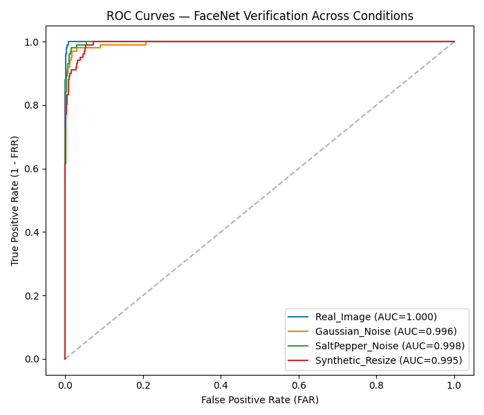

# Face Verification Under Age Gap and Image Degradation

## Overview

This project evaluates face verification using celebrity photographs
representing two ages separated by approximately **five years**. It
compares images of the same subject (genuine pairs) with images of
different subjects (impostor pairs), and studies how image degradation
affects verification performance.

## Objectives

-   Compare genuine and impostor cosine-similarity scores.
-   Evaluate original images against three degraded-image conditions.
-   Measure performance using FAR, FRR, EER, ROC curves, and AUC.

## Pipeline

1.  Load paired celebrity photographs.
2.  Prepare four conditions: original images, Gaussian noise,
    salt-and-pepper noise, and synthetic resizing.
3.  Use **MTCNN** to detect and align faces, using facial landmarks and
    bounding boxes.
4.  Use the pretrained FaceNet/InceptionResnetV1-style model in the
    notebook to extract face embeddings.
5.  Compare embeddings using cosine similarity.
6.  Calculate verification metrics and plot score distributions and ROC
    curves.

**MTCNN prepares the face; the recognition network extracts the
embedding.** A similarity threshold is then used to accept or reject a
pair.

## Dataset Format

The notebook is intended to use paired filenames in this style:

``` text
DataSet/
├── 0000_0.jpg
├── 0000_1.jpg
├── 0001_0.jpg
├── 0001_1.jpg
└── ...
```

The identifier represents the subject. `_0` and `_1` represent the two
images for that subject, separated by the age gap described above.
Ensure the dataset path and naming convention match the notebook.

The supplied results report **101 subjects** per condition. If there is
one genuine comparison per subject, this gives 101 genuine scores. If
every `_0` image is compared with every other subject's `_1` image,
there are 101 × 100 = 10,100 impostor comparisons.

## Degradation Conditions

-   **Real_Image:** original image, used as the baseline.
-   **Gaussian_Noise:** adds random intensity variation sampled from a
    Gaussian distribution to pixels.
-   **SaltPepper_Noise:** randomly changes selected pixels to black or
    white.
-   **Synthetic_Resize:** downsizes an image and then enlarges it again,
    simulating low resolution and loss of facial detail. This is an
    image degradation rather than a noise model in the strict sense.

## Metrics

-   **Cosine similarity:** compares face embeddings; higher scores
    indicate a stronger match in this experiment.
-   **Genuine pair:** two images belonging to the same subject.
-   **Impostor pair:** two images belonging to different subjects.
-   **FAR:** proportion of impostor pairs incorrectly accepted at a
    threshold.
-   **FRR:** proportion of genuine pairs incorrectly rejected at a
    threshold.
-   **ROC curve:** plots true positive rate (TPR = 1 − FRR) against
    false positive rate (FPR = FAR) across thresholds.
-   **AUC:** area under the ROC curve; closer to 1 indicates better
    separation.
-   **EER:** the error rate at the threshold where FAR and FRR are equal
    or closest. Lower EER is better. The EER value is different from the
    EER threshold.

## Results

| Condition | Subjects | Mean genuine score | Mean impostor score | EER (%) | EER threshold | TAR at EER threshold (%) | FAR at EER threshold (%) | AUC |
|---|---:|---:|---:|---:|---:|---:|---:|---:|
| Real_Image | 101 | 0.7392 | 0.0314 | 0.94 | 0.3943 | 99.01 | 0.89 | 0.9998 |
| Gaussian_Noise | 101 | 0.6750 | 0.0694 | 2.99 | 0.3615 | 97.03 | 3.00 | 0.9958 |
| SaltPepper_Noise | 101 | 0.6648 | 0.0449 | 1.71 | 0.3842 | 98.02 | 1.45 | 0.9981 |
| Synthetic_Resize | 101 | 0.6168 | 0.0453 | 4.73 | 0.3056 | 95.05 | 4.51 | 0.9949 |


## Interpretation

-   **Real images** have the strongest reported performance, with the
    lowest EER and highest AUC.
-   **Gaussian noise** lowers genuine similarity and increases EER
    compared with the original images.
-   **Salt-and-pepper noise** also lowers genuine similarity, but its
    EER is lower than the Gaussian-noise condition in these results.
-   **Synthetic resizing** has the highest EER and lowest AUC among the
    tested conditions, suggesting that loss of facial detail is
    especially harmful in this experiment.
-   These findings apply to this dataset and evaluation setup; they do
    not guarantee the same performance on other datasets or real-world
    deployments.

## Figures




### Score distributions

  -----------------------------------------------------------------------------
  Real images                          Gaussian noise
  ------------------------------------ ----------------------------------------
     distribution](results/dist_Gaussian_Noise.png)

  -----------------------------------------------------------------------------

  -------------------------------------------------------------------------------------
  Salt-and-pepper noise                      Synthetic resize
  ------------------------------------------ ------------------------------------------
     distribution](results/dist_Synthetic_Resize.png)

  -------------------------------------------------------------------------------------


## Limitations

-   The supplied results cover 101 subjects and four image conditions.
-   Performance depends on face detection/alignment, the pretrained
    embedding model, pair generation, and threshold selection.
-   For a fair comparison, use the same subjects and pair-generation
    protocol across conditions.
-   For formal research, check for duplicate or near-duplicate
    photographs and clearly document the dataset source and
    subject-selection method.

## Repository Structure

``` text
Advance_Biometrics/
└── LAB2/
    ├── DataSet/
    ├── results/
    │   ├── results_summary.csv
    │   ├── dist_Real_Image.png
    │   ├── dist_Gaussian_Noise.png
    │   ├── dist_SaltPepper_Noise.png
    │   ├── dist_Synthetic_Resize.png
    │   └── roc_all_conditions.png
    ├── main.ipynb
    └── README.md
```
## How to Run

Open `main.ipynb` in Jupyter Notebook, JupyterLab, or Google Colab. Make
sure the dataset is available at the path expected by the notebook,
install the packages imported by the notebook, and run the cells in
order.
